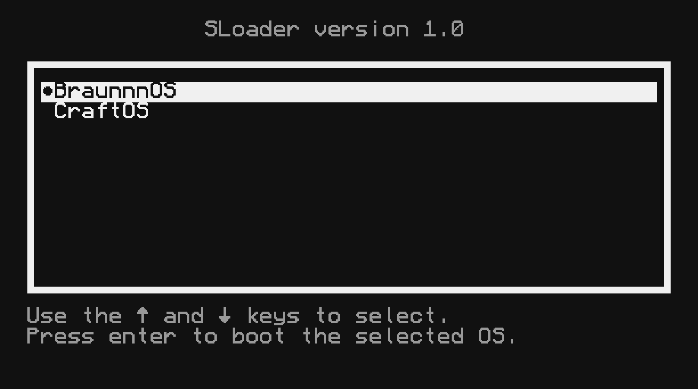
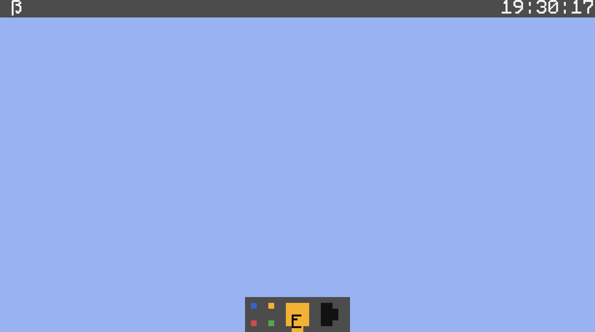
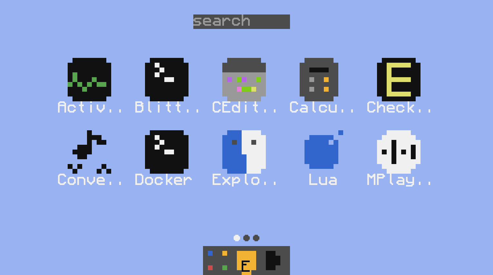

# BraunnnOS

**BraunnnOS** — is an operating system for ComputerCraft / CC:Tweaked / CraftOS-PC that provides multitasking and a clean, visually pleasing interface for interacting with built-in and user-created programs.





## 🚀 How to install?

Just run this command into shell:

```bash
wget run "https://raw.githubusercontent.com/aTimmYm/braunnnOS/refs/heads/dev/installer/installer.lua"
```
**THE CURRENT IMPLEMENTATION OF THE SYSTEM IS A TESTING PRE-RELEASE VERSION AND MAY CONTAIN BUGS AND IMPERFECTIONS. THE DEVELOPER IS NOT RESPONSIBLE FOR ANY POTENTIAL DAMAGE THAT MAY BE DIRECTLY OR INDIRECTLY CAUSED BY BRAUNNNOS. BY USING THIS SOFTWARE, YOU AGREE TO THESE TERMS. PLEASE REPORT ANY BUGS OR ISSUES.**
